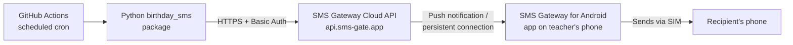
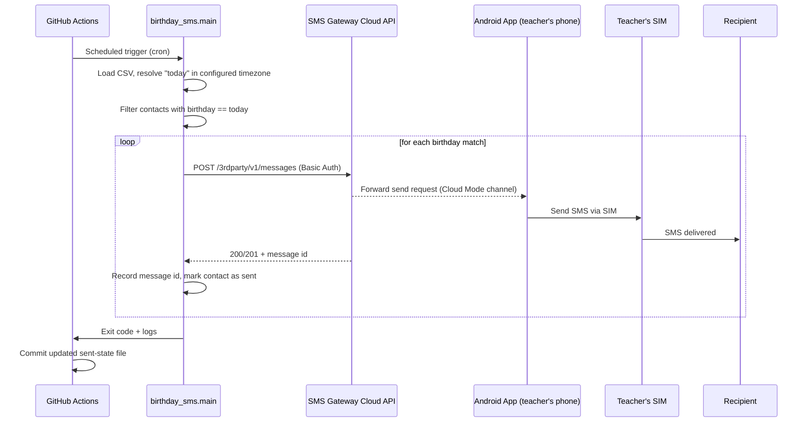
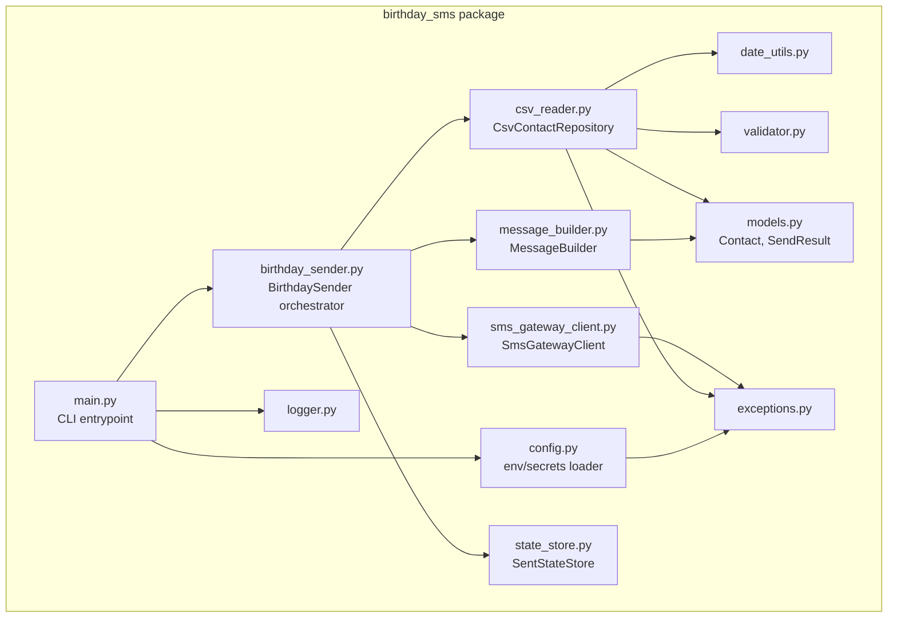
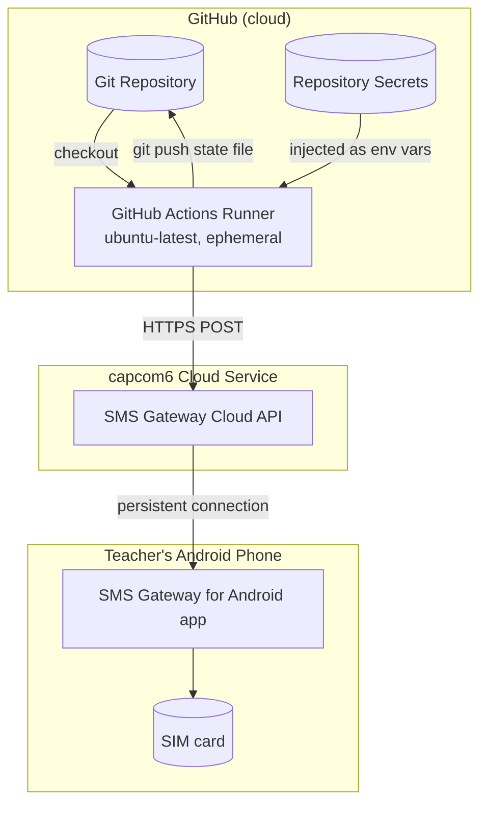
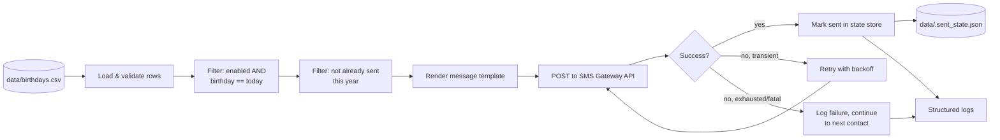

# Architecture

## 1. Introduction

Birthday SMS Automation sends a birthday text message to people on a
teacher's contact list, using the teacher's **own phone number and
SIM card**, with **no server, no PC, and no paid SMS API** required
to be running. The only always-on component is GitHub's infrastructure
(free for public/private repos within usage limits) and the teacher's
Android phone, which most people already keep on and connected to the
internet.

## 2. Objectives

- Send an SMS on a contact's birthday, automatically, every year.
- Never require a computer to be powered on at send time.
- Never route messages through a third-party SMS business API.
- Keep credentials out of source control.
- Fail loudly on configuration mistakes, fail *quietly and
  recoverably* on transient network issues.

## 3. High-Level Architecture



1. GitHub Actions wakes up on a daily cron schedule (or manual dispatch).
2. It checks out the repo and runs `python -m birthday_sms.main`.
3. The script reads `data/birthdays.csv`, finds contacts whose
   birthday matches today (in the configured timezone), and renders
   each message.
4. For each match, it sends an HTTPS POST to the SMS Gateway Cloud API
   with HTTP Basic Auth.
5. The cloud service relays the request to the Android app over its
   already-open connection (the app polls/holds a connection - it does
   not need to expose any port or have a static IP).
6. The Android app sends the actual SMS using the phone's SIM.
7. The workflow commits an updated "already sent" state file back to
   the repo so the same person isn't texted twice in one day.

## 4. Sequence Diagram



## 5. Component Diagram



## 6. Deployment Diagram



Nothing runs continuously except:
- GitHub's own infrastructure (managed, no cost for a daily job at
  this scale on the free tier for most account types).
- The Android app on the teacher's phone, which just needs to stay
  installed, logged into Cloud Mode, and connected to the internet -
  no different from any other messaging app running in the background.

## 7. Data Flow Diagram



## 8. Folder Structure

```
birthday-sms-automation/
├── .github/
│   └── workflows/
│       ├── daily.yml          # Scheduled birthday check + send
│       └── lint.yml           # Lint + unit tests on push/PR
├── data/
│   ├── birthdays.csv          # Contact list (edit this!)
│   └── .sent_state.json       # Auto-managed dedupe state
├── docs/
│   ├── ARCHITECTURE.md
│   ├── SECURITY.md
│   ├── SMS_GATEWAY_SETUP.md
│   ├── DEPLOYMENT.md
│   ├── TROUBLESHOOTING.md
│   ├── FAQ.md
│   └── CONTRIBUTING.md
├── src/
│   └── birthday_sms/
│       ├── __init__.py
│       ├── main.py            # CLI entrypoint
│       ├── config.py          # Env var / secrets loading
│       ├── constants.py
│       ├── exceptions.py
│       ├── models.py          # Contact, SendResult, SendStatus
│       ├── csv_reader.py      # CsvContactRepository
│       ├── date_utils.py
│       ├── validator.py
│       ├── message_builder.py # Template rendering engine
│       ├── sms_gateway_client.py  # HTTP client w/ retry+backoff
│       ├── state_store.py     # Duplicate-send prevention
│       ├── birthday_sender.py # Orchestrator
│       └── logger.py
├── tests/
│   ├── test_date_utils.py
│   ├── test_validator.py
│   ├── test_message_builder.py
│   ├── test_csv_reader.py
│   ├── test_sms_gateway_client.py
│   ├── test_birthday_sender.py
│   └── test_config.py
├── .env.example
├── .flake8
├── .gitignore
├── LICENSE
├── pyproject.toml
├── requirements.txt
├── requirements-dev.txt
└── README.md
```

## 9. Technology Stack

| Layer               | Choice                                   | Why |
|----------------------|-------------------------------------------|-----|
| Language             | Python 3.12+                              | Type hints, `zoneinfo`, dataclasses with `slots=True`, mature ecosystem |
| HTTP client          | `requests`                                 | Simple, well-tested, widely available |
| Scheduling           | GitHub Actions `schedule` (cron)           | Free, no server to maintain, version-controlled |
| SMS transport        | SMS Gateway for Android (capcom6), Cloud Mode | Only real SIM-based option that needs no server; see below |
| Data store            | CSV (contacts) + JSON (dedupe state)       | Zero-infrastructure, human-editable, diffable in Git |
| Testing               | `pytest`, `responses` (HTTP mocking)       | Fast, no real network calls in CI |
| Linting/formatting    | `black`, `isort`, `flake8`                 | Consistent style, CI-enforced |

## 10. Why SMS Gateway for Android

The single hard constraint in this project is: **the SMS must come
from the teacher's own SIM, with no PC or paid API involved.**
SMS Gateway for Android (capcom6, open source) is built exactly for
this:

- It's an app installed once on the teacher's phone.
- **Cloud Mode** means the app maintains its own outbound connection
  to a cloud relay - the automation script never needs the phone's IP
  address, and the phone can be on any network (Wi-Fi or mobile data).
- It exposes a simple REST API (username/password) that any HTTP
  client - including a GitHub Actions runner - can call.
- It is not a marketing/OTP bulk-SMS business API, so there's no
  per-message billing, sender-ID registration, or template
  pre-approval process to go through.

## 11. Why GitHub Actions

- **No server to maintain.** No VPS, no cron daemon to keep alive, no
  systemd unit to write.
- **Free scheduled execution** for most repositories within GitHub's
  usage limits.
- **Secrets management built in** (repository Secrets), so credentials
  never touch the CSV or source code.
- **Auditable.** Every run produces a log you can inspect later, and
  every change to the contact list or code goes through Git history.
- **Manual dispatch** lets the teacher trigger a run on demand (e.g.
  to test) without touching a terminal.

## 12. Advantages

- Zero ongoing infrastructure cost for the automation itself.
- The teacher keeps full control of the sending number - recipients
  see a message from a number they may already recognize.
- Fully auditable: CSV, code, and workflow are all in Git history.
- Retries and structured logs make failures diagnosable after the fact.

## 13. Limitations

- **The teacher's phone must be on and connected to the internet** at
  the time the workflow runs. If it's off, the SMS Gateway Cloud
  relay cannot forward the request, and the send will fail (it will
  be logged as a failure and can be manually re-run).
- **GitHub Actions cron schedules are not guaranteed to the minute** -
  GitHub documents that scheduled workflows may be delayed during
  periods of high load. For a once-a-day birthday message this is
  rarely noticeable, but it is not a real-time system.
- **SMS costs are whatever the teacher's own carrier plan charges**
  for sending a text - this project does not eliminate carrier SMS
  costs, only third-party API costs.
- Free tier GitHub Actions minutes are finite; a daily job at this
  scale uses only a few minutes/month, but very large contact lists
  or very frequent schedules could approach usage limits.

## 14. Threat Model (Summary)

See [`SECURITY.md`](SECURITY.md) for the full write-up. In short: the
main asset to protect is the SMS Gateway Cloud credential pair, which
grants the ability to send SMS from the teacher's phone. It is stored
only as a GitHub Actions Secret, never in the repository, transmitted
only over HTTPS, and scoped to nothing beyond message sending.

## 15. Failure Scenarios & Recovery

| Scenario | Detection | Recovery |
|---|---|---|
| Phone offline at send time | `SmsGatewayUnavailableError` after retries exhausted | Message logged as `FAILED`; re-run manually via `workflow_dispatch` once phone is back online (dedupe state was not set, so it will resend) |
| Wrong credentials | `SmsGatewayAuthenticationError`, not retried | Update `SMS_GATEWAY_USERNAME`/`PASSWORD` secrets, re-run |
| Malformed CSV row | `CsvRowError` logged, row skipped | Fix the specific row in `data/birthdays.csv`; other rows unaffected |
| Entire CSV missing/renamed | `CsvFileNotFoundError`, run aborts | Restore file or fix `BIRTHDAY_CSV_PATH` |
| Gateway returns unexpected schema | `SmsGatewayResponseError` | Check for a capcom6 API version change; see `TROUBLESHOOTING.md` |
| Duplicate workflow trigger same day | State store already marked | Second attempt logged as `SKIPPED_ALREADY_SENT`, no duplicate SMS sent |

## 16. Logging & Monitoring

- All runs log to stdout, visible directly in the GitHub Actions run
  view under **Actions → Daily Birthday SMS → (run) → send-birthday-sms**.
- Every contact is logged with an outcome: `SENT`, `FAILED`,
  `SKIPPED_NOT_TODAY`, `SKIPPED_DISABLED`, `SKIPPED_ALREADY_SENT`, or
  `DRY_RUN`.
- A per-run summary line aggregates counts by outcome.
- Optional JSON-lines file logging is available via
  `configure_logging(log_file=...)` for teams that want to ship logs
  elsewhere.
- GitHub sends an email/notification automatically if a scheduled
  workflow run fails outright (e.g. CSV missing), giving passive
  monitoring with no extra setup.

## 17. Versioning Strategy

This project follows [Semantic Versioning](https://semver.org/):
`MAJOR.MINOR.PATCH`. Breaking changes to the CSV schema or CLI
behavior bump `MAJOR`; new optional fields/features bump `MINOR`; bug
fixes bump `PATCH`. The current version is tracked in
`src/birthday_sms/__init__.py` and `pyproject.toml`.

## 18. Future Improvements

- Optional multi-channel fallback (e.g. email) if SMS send fails.
- Web UI for editing the contact CSV without touching Git directly.
- Support for recurring reminders (e.g. "3 days before birthday").
- Per-contact custom send time instead of a single daily run.
