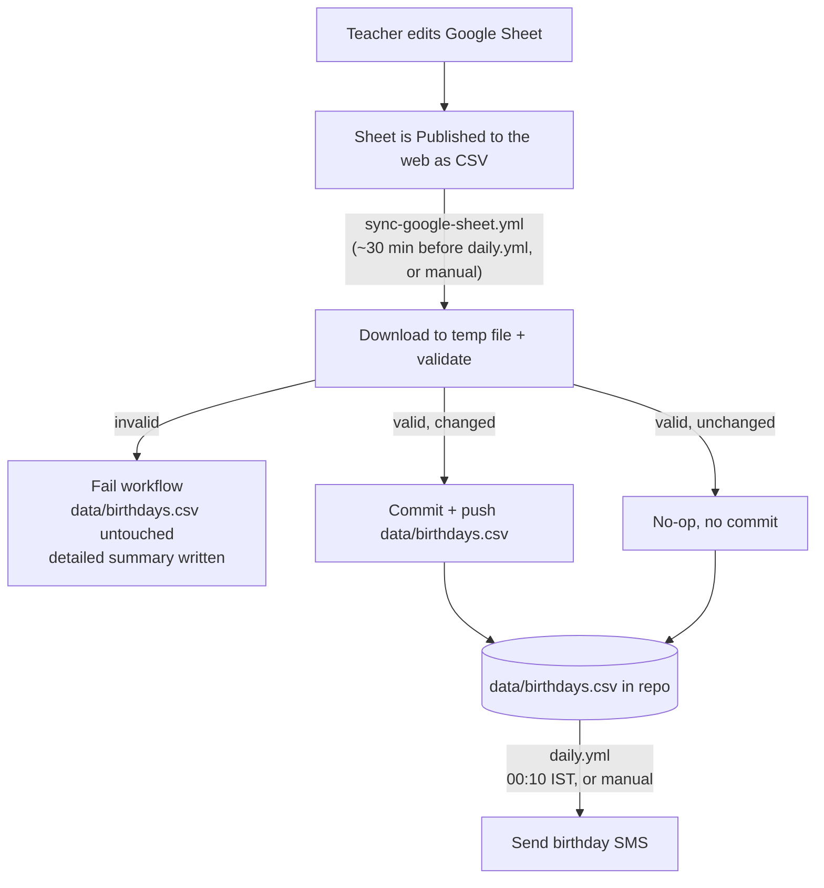

# Google Sheets Sync

The teacher edits contacts in a Google Sheet. A dedicated workflow,
[`sync-google-sheet.yml`](../.github/workflows/sync-google-sheet.yml),
validates that sheet and — only if it passes every check — copies it into
`data/birthdays.csv` and commits it.

`daily.yml` already never talks to Google Sheets: it only reads whatever
`data/birthdays.csv` is currently committed in the repo. That means a
Sheets outage, a broken publish link, or a teacher mid-edit can delay a
sync, but can never block or corrupt today's birthday send — no changes
to `daily.yml` were needed for this.



## Why a separate workflow, not chained to daily.yml

`daily.yml`'s only job is to reliably send birthday texts on time, every
day. Anything that can fail for reasons outside your control — a
temporarily unpublished sheet, a Google outage, a malformed row someone
just typed — must never threaten that. So validation and syncing live
entirely in `sync-google-sheet.yml`, which can fail loudly and safely
without touching `daily.yml` at all.

The two workflows are intentionally **not chained** (e.g. via
`workflow_run`): chaining `daily.yml` to only fire after a successful sync
would mean a sync failure also blocks the birthday send. Instead they're
decoupled and simply scheduled with a buffer — sync runs at `18:10 UTC`
(`23:40 IST`), about 30 minutes before `daily.yml`'s `18:40 UTC`
(`00:10 IST`) run — so the repo has the freshest validated data by the
time birthdays are checked, but `daily.yml` will run and send from
whatever `data/birthdays.csv` last successfully synced, even if today's
sync failed or never ran.

## 1. Publishing the Google Sheet

1. In Google Sheets: **File → Share → Publish to web**.
2. Choose the specific sheet/tab containing contacts (not "Entire
   Document").
3. Set the format to **Comma-separated values (.csv)**.
4. Click **Publish** and copy the generated URL — it looks like:
   `https://docs.google.com/spreadsheets/d/e/<long-id>/pub?gid=<gid>&single=true&output=csv`

> **If you accidentally publish as "Web page" instead:** you'll get a
> `.../pubhtml?...` link, which serves an HTML page, not data — this is a
> common source of "formatting" errors if you try to use it directly. The
> sync workflow auto-detects and normalizes this (converts `pubhtml`→`pub`
> and forces `output=csv`) as a safety net, and will fail loudly with a
> clear Summary message if it still gets HTML back instead of CSV. Still,
> publishing correctly as CSV in the first place is the real fix — the
> auto-normalization is a fallback, not a substitute.

> **If phone numbers show up wrong (scientific notation, missing `+`,
> dropped leading digits) even with a proper CSV publish:** this is a
> Sheets *data* problem, not a sync problem. Unless a column is explicitly
> set to **Plain text**, Sheets treats anything that looks numeric as a
> number — `+919876543210` silently becomes `919876543210`, or worse,
> `9.19878E+11`, and the CSV export contains that corrupted value, not
> what you actually typed. Fix, in the Sheet:
> 1. Select the `PhoneNumber` column (and `Birthday`, if dates look off
>    too).
> 2. **Format → Number → Plain text**.
> 3. Re-enter the affected values (or prefix each with an apostrophe,
>    e.g. `'+919876543210`, which forces Sheets to treat it as text).
> 4. Republish.
>
> The sync workflow also detects this pattern automatically — a
> scientific-notation or bare-digits-no-`+` phone number fails validation
> with a message pointing back to this fix, so a future accidental
> reformat gets caught at sync time instead of silently corrupting
> `data/birthdays.csv`.

**Sheet column requirements** — the header row must contain:

| Column | Required | Notes |
|---|---|---|
| `Name` | ✅ | Value must be non-blank per row |
| `PhoneNumber` | ✅ | Value must be non-blank per row, E.164 format |
| `Birthday` | ✅ | Value must be non-blank per row, one of the 4 supported formats |
| `Classification` | ✅ (header only) | Values may be blank |
| `Enabled` | ✅ (header only) | Blank = enabled; `FALSE`/`0`/`NO`/`N` = disabled |
| `Brief`, `Address`, `LastSent`, `MessageTemplate` | optional | |

> **Security note:** a "Published to web" CSV link is unauthenticated —
> anyone with the URL can read it. Treat the published URL as a secret;
> the sync workflow masks it in logs and never writes it to the summary.

## 2. Repository secret configuration

1. GitHub repo → **Settings → Secrets and variables → Actions → Secrets**.
2. **New repository secret**.
3. Name: `BIRTHDAY_CSV_URL`
4. Value: the `.../pub?...output=csv` URL from step 1.

This is separate from `SMS_GATEWAY_USERNAME` / `SMS_GATEWAY_PASSWORD`,
which `daily.yml` uses directly and which `sync-google-sheet.yml` never
touches.

## 3. Manual sync

**Actions** tab → **Sync Google Sheet Contacts** → **Run workflow**.

Optionally supply `csv_url_override` to test against a different sheet URL
for that run only, without changing the secret.

## 4. Scheduled sync

Runs daily at `18:10 UTC` / `23:40 IST` (see the `schedule:` block in
[`sync-google-sheet.yml`](../.github/workflows/sync-google-sheet.yml)),
about 30 minutes ahead of `daily.yml`. Like `daily.yml`'s own cron, GitHub
Actions schedules aren't guaranteed to fire at the exact minute — if that
matters for your use case, drive this workflow from the same external
scheduler ([cron-job.org](https://cron-job.org)) used for `daily.yml`,
pointed at `sync-google-sheet.yml` instead of (or in addition to) it.

To change the schedule, edit the `cron:` line in
[`.github/workflows/sync-google-sheet.yml`](../.github/workflows/sync-google-sheet.yml).

## 5. What gets validated

Every sync run validates the downloaded file **before** it's allowed to
touch `data/birthdays.csv`. The validator lives at
`src/birthday_sms/validate_and_sync_csv.py` — inside the application
package itself, invoked as `python -m birthday_sms.validate_and_sync_csv`
rather than as a standalone script — so it can import
`CsvContactRepository` as a normal in-package absolute import. Row-level
parsing (required fields, phone E.164 format, birthday date format) is
delegated entirely to `birthday_sms.csv_reader.CsvContactRepository.load()`
— the exact same code path `daily.yml` uses — so there's no separate
validation logic to keep in sync with the app. It isn't imported by any
other module, so it has no effect on `python -m birthday_sms.main` or
anything else at runtime.

On top of that:

- HTTP download succeeded (status 200) and the file isn't empty.
- Valid CSV structure — no rows with too many or too few fields
  (blank trailing lines from Sheets/Excel exports are ignored, not
  flagged).
- Required headers present: `Name`, `PhoneNumber`, `Birthday`,
  `Classification`, `Enabled`.
- No duplicate `PhoneNumber` values (checked after the real parser's own
  E.164 normalization).
- **Phone numbers that look like Sheets auto-formatting corruption**
  (scientific notation, or a bare digit string with no `+` where Sheets
  likely stripped it) are flagged with a specific fix-it message, not
  just a generic "invalid phone number" — see the note in step 1 above.
- At least one contact is both enabled and fully valid.
- **Any row the real parser has to skip is treated as a hard failure.**
  At runtime, `birthday_sms.csv_reader` intentionally skips-and-logs bad
  rows rather than aborting, so one bad contact never blocks everyone
  else's SMS — that's the right behavior for a live send. But the sync
  gate is stricter on purpose: it refuses to promote a sheet into the
  repo if the app's own parser couldn't fully understand every row in it,
  so problems get caught (and shown to the teacher/admin) at sync time
  instead of silently dropping a contact forever.

If `birthday_sms` can't be imported in the workflow for any reason, an
equivalent built-in fallback validator runs instead — the sync never
silently skips validation.

## 6. Failure handling

If **any** check fails:

- `data/birthdays.csv` is **not** modified — the previous, last-known-good
  version stays in place.
- Nothing is committed or pushed.
- The workflow run is marked **failed**.
- The **Summary** tab of that workflow run lists every validation issue
  found, using the real parser's own error text (e.g. `Row 4: Birthday
  '16-May-1999' does not match any supported format...`) where available.

This includes the case where the downloaded content turns out to be an
HTML page instead of CSV (e.g. a `pubhtml` link that couldn't be
normalized, or a sign-in page) — the workflow checks for this before the
file ever reaches the validator and fails with a specific "Downloaded
content is HTML, not CSV" message rather than trying to parse it as data.

Because `daily.yml` only reads the repo's `data/birthdays.csv`, a failed
sync has zero effect on that day's (or any future day's) birthday sends —
it just means the sheet's latest edits haven't made it into the repo yet.

## 7. Recovery process

1. Open the failed run's **Summary** tab and read the listed issues.
2. Fix the offending row(s) directly in the Google Sheet (common causes:
   a birthday typed as `16 May 1999` instead of a supported format, a
   copy-pasted duplicate phone number, a blank required field, or a
   `PhoneNumber`/`Birthday` column that isn't set to Plain Text and got
   auto-reformatted by Sheets — see step 1 above).
3. Re-run the sync: **Actions → Sync Google Sheet Contacts → Run
   workflow**, or wait for the next scheduled run.
4. Confirm the new run's Summary shows **✅ Validation Passed** and check
   the added/removed/modified counts match what you expect.

If the sync itself can't run at all (e.g. `BIRTHDAY_CSV_URL` secret is
missing or the sheet's publish link changed), the workflow fails at the
download step with a clear error in the Summary — re-publish the sheet
(step 1 above) and/or update the secret (step 2), then re-run.

## 8. Idempotency

Re-running the sync with unchanged sheet data produces **no commit**, even
across separate runs with separate temp-file downloads. The comparison is
row-level (by `PhoneNumber`), not byte-for-byte, so line-ending or column-
order differences introduced by Google's CSV export (Google Sheets exports
use CRLF line endings) don't trigger spurious commits — `data/birthdays.csv`
is always rewritten in a normalized form when it does change.

## Testing

```bash
pytest tests/test_validate_and_sync_csv.py -v
```

Both code paths are exercised deterministically in every run: the
fallback-validator tests force `birthday_sms.csv_reader` to be
unimportable via monkeypatching (so they don't depend on whatever happens
to be installed), and the reuse-path tests run against the real
`CsvContactRepository`, including a full pass over a 44-contact sample CSV
in `tests/fixtures/sample_birthdays.csv` (synthetic data, not real
contacts).